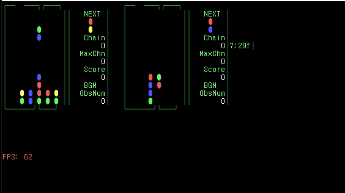

# new Puyo C



new Puyo C with C++ on cross platform (windows & POSIX), which can play 1 vs 1 remote battle

## How to Build

```
git clone https://github.com/Leeingnyo/newPuyoC.git
cd newPuyoC
make
./new_puyo_c
```

## TODO (that would be never done forever)

* add animation effect when sending bubble puyo to other player like old version
* random matching game server
